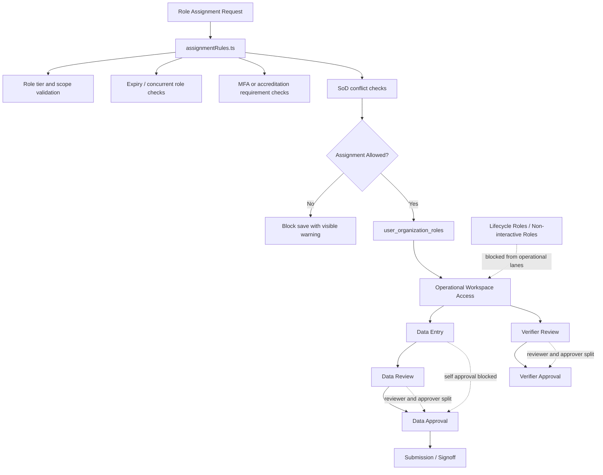

# Organization Flow Charts

Last updated: 2026-03-16

## Purpose

This is the living visual map for the portal.

Why this file exists:
- It gives training, audit, QA, and future developers one place to understand how the organization, auth, SoD, and data flows fit together.
- It complements [ActiveRoleListandFeatures.md](./ActiveRoleListandFeatures.md) by showing system flow instead of role-by-role detail.
- It should reflect the live frontend architecture only. Do not document future intent here as if it already exists.

## Update Rule

- Update this file in the same PR whenever frontend work changes auth flow, route resolution, role topology, SoD behavior, approval flow, public intake flow, or core data movement.
- Keep the diagrams truthful to the live implementation in `proxy.ts`, `context/AuthContext.tsx`, `lib/auth/*`, `features/*`, and the active DB-backed routes.
- If a flow depends on a known backend or schema workaround, note that limitation directly in this file and also keep [DB_FOLLOW_UP.md](./DB_FOLLOW_UP.md) aligned.

## Diagram 1: Organization And Workspace Topology

```mermaid
flowchart TD
    A[Platform Team] --> A1[Platform Superadmin]
    A --> A2[Platform Admin]
    A --> A3[Platform Developer / Platform Support]
    A --> A4[Platform Auditor]
    A --> A5[Platform CRM / Platform Sales / Platform Finance]
    A --> A6[Digital Twin Engineer / Platform Data Scientist]
    A --> A7[DPO / Grievance Officer]

    B[Client Organization] --> B1[Client Superadmin / Client Admin / Client IT Admin]
    B --> B2[Subsidiary Admin]
    B --> B3[Sustainability Head / ESG Manager / CBAM Compliance Officer]
    B --> B4[Carbon Accountant / Regulatory Filing Agent / Supply Chain Analyst]
    B --> B5[Data Entry Operator / Facility Manager / Data Reviewer / Data Approver]
    B --> B6[Executive / Finance / Investor / Lender Viewers]

    C[Verifier And External Roles] --> C1[Verifier Lead / Reviewer / Approver / ISO]
    C --> C2[CBAM Verifier / Regulatory Inspector]
    C --> C3[Board Report Recipient]

    D[Org Structure] --> D1[client_organizations]
    D1 --> D2[client_legal_entities]
    D2 --> D3[client_sites]
    D3 --> D4[Operational Workspaces]

    D4 --> W1[Dashboard Home]
    D4 --> W2[Platform Ops / Commercial / Models]
    D4 --> W3[Activity / Sources / Reports]
    D4 --> W4[Accounting / Audit / Verifier]
    D4 --> W5[Org Users / Facilities / Integrations]
    D4 --> W6[Sustainability Targets / Disclosures / CBAM / Offsets]
    D4 --> W7[Governance / Privacy / Grievances]
    D4 --> W8[Finance / Consulting / Public Legal / Public Calculator]
```



## Diagram 2: Auth And Route Resolution Flow

```mermaid
flowchart TD
    R[Browser Request] --> P[proxy.ts]
    P --> P1{Public Route?}
    P1 -- Yes --> PUB[Serve Public Page]
    P1 -- No --> SSR[Supabase SSR Cookie Resolution]

    SSR --> SSR1{User From Cookie?}
    SSR1 -- No --> O404[Opaque 404 Response]
    SSR1 -- Yes --> JWT[JWT app_metadata claims]

    JWT --> CL1[roles]
    JWT --> CL2[org_ids / primary_org_id]
    JWT --> CL3[scope_site_ids / scope_legal_entity_ids]
    JWT --> CL4[lifecycle posture]

    CL1 --> AUTHCTX[context/AuthContext.tsx]
    CL2 --> AUTHCTX
    CL3 --> AUTHCTX
    CL4 --> AUTHCTX

    AUTHCTX --> ROUTEACCESS[lib/auth/routeAccess.ts]
    AUTHCTX --> DASHREG[lib/auth/dashboardRegistry.ts]
    AUTHCTX --> SIDEBAR[Sidebar / Navigation]
    AUTHCTX --> SESSIONSCOPE[lib/auth/sessionScope.ts]

    ROUTEACCESS --> ALLOW{Route Allowed?}
    ALLOW -- No --> O404A[Opaque 404 Response]
    ALLOW -- Yes --> DASH[Live Route Workspace]

    DASH --> DASH1[/dashboard/platform/operations]
    DASH --> DASH2[/dashboard/platform/commercial]
    DASH --> DASH3[/dashboard/platform/models]

    SESSIONSCOPE --> DASH
    DASHREG --> DASH
```

Notes:
- `proxy.ts` is the active request guard.
- JWT `app_metadata` is the live frontend auth truth, not stale profile metadata.
- `board_report_recipient` remains non-interactive even when authenticated.
- Protected-route misses intentionally use the same generic 404 experience as genuinely missing routes.

## Diagram 3: SoD And Approval Control Flow



Notes:
- The frontend keeps SoD visible in role assignment, dashboard behavior, and approval UX.
- Reviewer and approver lanes are intentionally separated.
- Non-interactive and lifecycle-restricted roles do not receive operational dashboards.

## Diagram 4: Data, Evidence, And Reporting Flow

```mermaid
flowchart TD
    PS[Public Surface] --> PS1[Landing Demo Request]
    PS --> PS2[CBAM Calculator Lead Capture]
    PS --> PS3[Privacy / DSAR Request]

    PS1 --> L1[leads]
    PS2 --> L1
    PS3 --> DSR[data_subject_access_requests]

    OPS[Operational Data Entry] --> S1[ghg_emission_source_register]
    OPS --> S2[activity_data]
    S2 --> S3[ghg_monthly_readings]
    S3 --> S4[ghg_documents]
    S3 --> S5[ghg_submissions]
    S5 --> S6[ghg_signoff_chain]

    GOV[Governance Workspace] --> G1[consent_records]
    GOV --> G2[security_incidents]
    GOV --> G3[ropa_entries]
    GOV --> G4[dpia_register]
    GOV --> G5[international_data_transfers]

    SUS[Sustainability Workspace] --> F1[disclosure_frameworks]
    SUS --> F2[framework_indicators]
    SUS --> F3[framework_disclosures]
    SUS --> F4[regulatory_filings]

    VER[Verifier Workspace] --> V1[verifiers]
    VER --> V2[ghg_verifications]

    REP[Reporting / Executive / Dashboards] --> MV1[v_active_* views]
    REP --> MV2[mv_site_emissions]
    REP --> MV3[mv_targets_progress]
    REP --> MV4[mv_ai_validation_summary]
    REP --> MV5[get_my_annual_emissions()]
```

Notes:
- Public calculator and landing lead capture both point to the live `leads` table today.
- Some richer public intake details still depend on later schema work documented in [DB_FOLLOW_UP.md](./DB_FOLLOW_UP.md).
- Reporting routes should consume the current views and functions instead of old prototype tables.
- Sustainability disclosure readiness now depends on live framework, indicator, disclosure, and filing rows rather than legacy compliance widgets.
